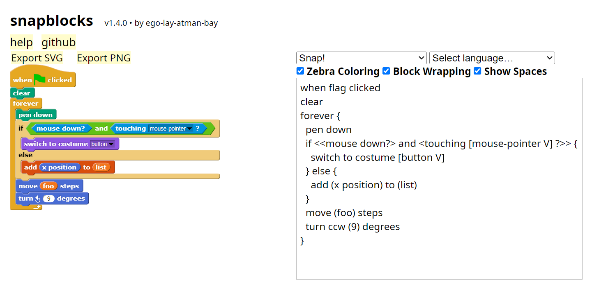

Make pictures of Snap<i>!</i> blocks from text.

[](http://snap-blocks.github.io/#?style=snap&script=when%20flag%20clicked%0Aclear%0Aforever%20%7B%0A%20%20pen%20down%0A%20%20if%20%3C%3Cmouse%20down%3F%3E%20and%20%3Ctouching%20%5Bmouse-pointer%20v%5D%3F%3E%3E%20%7B%0A%20%20%20%20switch%20costume%20to%20%5Bbutton%20v%5D%0A%20%20%7D%20else%20%7B%0A%20%20%20%20add%20(x%20position)%20to%20(list)%0A%20%20%7D%0A%20%20move%20(foo)%20steps%0A%20%20turn%20ccw%20(9)%20degrees%0A%7D)


**[Try it out!](https://snap-blocks.github.io/snapblocks)**

---

**snapblocks** is a fork of **scratchblocks** which aims to be more catered towards Snap<i>!</i>. These changes include, adding Snap<i>!</i> blocks, inputs, icons, and more.

---

**snapblocks** is used to write Snap scripts:

- in [Snap Forum](https://forum.snap.berkeley.edu/) posts
- in [Snap Wiki](https://snapwiki.miraheze.org/) articles

These currently use the original scratchblocks, but the wiki is working on transitioning over. I have a feeling once I mention this on the forum, they will also transition over.

It's MIT licensed, so you can use it in your projects.

For the full guide to the syntax, see [the wiki](https://en.scratch-wiki.info/wiki/Block_Plugin/Syntax) (hopefully when this is finished, we can make a snapblocks syntax article on the snap wiki).

<!-- removed for now
# Differences from scratchblocks

As you can probably tell, snapblocks is for Snap<i>!</i>, which means that there are many things that need to be changed.

## Define block

First and foremost, the define block. There is a big issue with the scratchblocks implementation. The define keyword forces a block outline, making it impossible to create the snap "define" block. Take a look for yourself.

```scratchblocks
define ((block) :: control) [] (() @addInput :: grey ring) :: stack control
```


This is not at all how it's supposed to look, in fact, it's very bad. Snapblocks fixes this by not forcing the define block outline, inputs, and also by changing the scratch define block syntax.

```snapblocks
define ((block)) [] (() @addInput)
```


The scratchblocks define block just takes the `define` keyword, then whatever's after is, is the new block. This may look fine, but sometimes you'll run into issues like this. Snapblocks changes the scratch define block syntax to be more strict, as in, it doesn't assume I want a weird block with a white block outline.

```snapblocks
define {block}
```


 -->


# Usage

All of these, except html, currently do not have a snapblocks version, but it shouldn't be too hard to modify them to add snapblocks support.

## MediaWiki

Use [the MediaWiki plugin](https://github.com/snap-blocks/mw-snapblocks) (work in progress).

## WordPress

I found [a WordPress plugin](https://github.com/tkc49/scratchblocks-for-wp).
It might work for you; I haven't tried it.

## HTML

You'll need to include a copy of the snapblocks JS file on your webpage.
There are a few ways of getting one:

* Download it from the <https://github.com/snap-blocks/snapblocks/releases> page
* If you have a fancy JS build system, you might like to include the `snapblocks` package from NPM (when it's on NPM)
* You could clone this repository and build it yourself using Node 16.14.0+ (`npm run build`).

```html
<script src="snapblocks-min.js"></script>
```

The convention is to write snapblocks inside `pre` tags with the class `blocks`:
```html
<pre class="blocks">
when flag clicked
move (10) steps
</pre>
```

You then need to call `scratchblocks.renderMatching` after the page has loaded.
Make sure this appears at the end of the page (just before the closing `</body>` tag):
```js
<script>
snapblocks.renderMatching('pre.blocks', {
  style:     'snap',       // Optional, defaults to 'scratch2'.
  languages: ['en', 'de'], // Optional, defaults to ['en'].
  scale: 1,                // Optional, defaults to 1
});
</script>
```

The `renderMatching()` function takes a CSS-style selector for the elements that contain snapblocks code: we use `pre.blocks` to target `pre` tags with the class `blocks`.

The `style` option controls how the blocks appear, either the Snap, Scratch 2, or Scratch 3 style is supported.

### Inline blocks

You might also want to use blocks "inline", inside a paragraph:
```html
I'm rather fond of the <code class="b">cut from [ v]</code> block in Snap.
```

To allow this, make a second call to `renderMatching` using the `inline` argument.
```js
<script>
snapblocks.renderMatching("pre.blocks", ...)

snapblocks.renderMatching("code.b", {
  inline: true,
  // Repeat `style` and `languages` options here.
});
</script>
```
This time we use `code.b` to target `code` blocks with the class `b`.

### Translations

Note: currently translations are partially broken, but I hope to get them fixed in v1.1.0.

If you want to use languages other than English, you'll need to include a second JS file that contains translations.
The releases page includes two options; you can pick one:

* `translations.js` includes a limited set of languages, as seen on the Scratch Forums
* `translations-all.js` includes every language that Scratch supports.

The translations files are hundreds of kilobytes in size, so to keep your page bundle size down you might like to build your own file with just the languages you need.

For example, a translations file that just loads the German language (ISO code `de`) would look something like this:
```js
window.snapblocks.loadLanguages({
    de: <contents of locales/de.json>
})
```

If you're using a JavaScript bundler you should be able to build your own translations file by calling `require()` with the path to the locale JSON file.
This requires your bundler to allow importing JSON files as JavaScript.
```js
window.snapblocks.loadLanguages({
    de: require('snapblocks/locales/de.json'),
})
```

## NPM

The `snapblocks` package will be published on NPM, and you can use it with browserify and other bundlers, if you're into that sort of thing.

Once you've got browserify set up to build a client-side bundle from your app
code, you can just add `snapblocks` to your dependencies, and everything
should Just Work™.

```js
var snapblocks = require('snapblocks');
snapblocks.renderMatching('pre.blocks');
```

## ESM Support
Since version 3.6.0, scratchblocks (and subsequently snapblocks) can be properly loaded as an ESM module. The ESM version, instead of defining `window.snapblocks`, default-exports the `snapblocks` object. Similarly, the JavaScript translation files default-exports a function to load the translations.

```js
import snapblocks from "./snapblocks-es-min.js";
import loadTranslations from "./translations-all-es.js";
loadTranslations(snapblocks);

// window.snapblocks is NOT available!
```

# Languages

To update the translations:
```sh
npm upgrade scratch-l10n
npm run locales
```

## Adding a language

Each language **requires** some [additional words](https://github.com/ego-lay-atman-bay/snapblocks/blob/master/locales-src/extra_aliases.js) which aren't in Scratch itself (mainly the words used for the flag and arrow images).
I'd be happy to accept pull requests for those! You'll need to rebuild the translations with `npm run locales` after editing the aliases.

# Development

This should set you up and start a http-server for development:

```
npm install
npm start
```

Then open <http://localhost:8000/> :-)

For more details, see [`CONTRIBUTING.md`](https://github.com/snap-blocks/snapblocks/blob/master/.github/CONTRIBUTING.md).


# Credits

Many, many thanks to the [contributors](https://github.com/snap-blocks/snapblocks/graphs/contributors)!

* Maintained by [ego-lay-atman-bay](https://github.com/ego-lay-atman-bay)
* This is a fork of [scratchblocks](https://github.com/scratchblocks/scratchblocks), so all the credit there still applies here.
* Original scratchblocks by [tjvr](https://github.com/tjvr)
* Icons derived from [Scratch Blocks](https://github.com/scratchfoundation/scratch-blocks) (Apache License 2.0) and [Snap<i>!</i>](https://github.com/jmoenig/Snap/blob/master/src/symbols.js)
* Scratch 2 SVG proof-of-concept, shapes & filters by [as-com](https://github.com/as-com)
* Anna helped with a formula, and pointed out that tjvr can't read graphs
* JSO designed the syntax and wrote the original [Block Plugin](https://en.scratch-wiki.info/wiki/Block_Plugin_\(1.4\))
* Help with translation code from [joooni](https://scratch.mit.edu/users/joooni/)
* Block translations from the [scratch-l10n repository](https://github.com/scratchfoundation/scratch-l10n/)
* Ported to node by [arve0](https://github.com/arve0)
